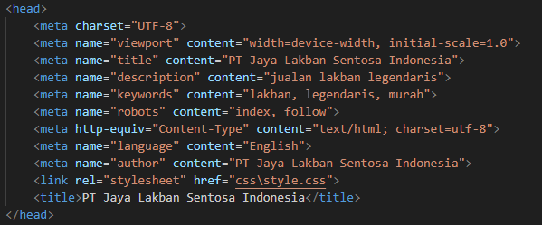
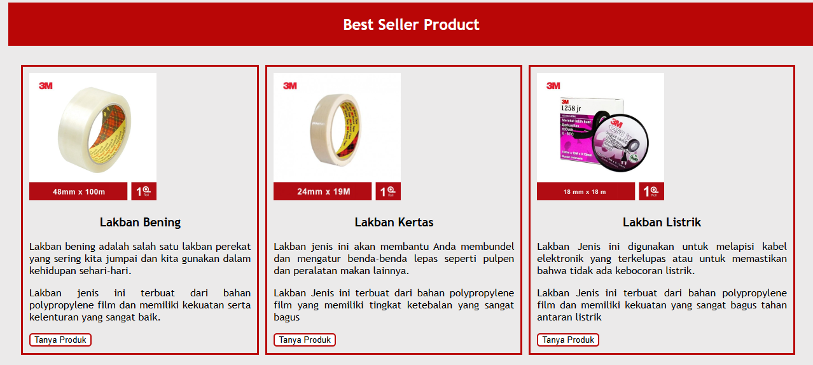
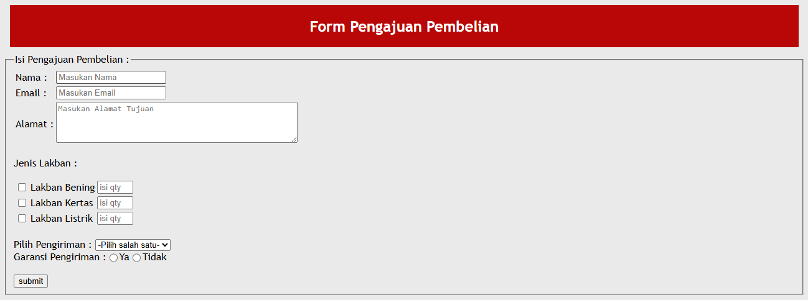
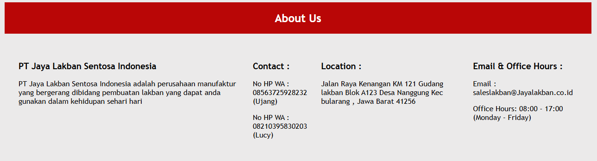
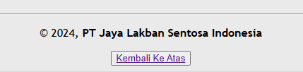

## Website PT Jaya Lakban Sentosa Indonesia

Readme ini bertujuan untuk memberi gambaran apa saja fungsi pada website ini, silahkan disimak 😊

### Meta Tag Website

Website ini menggunakan meta tag yang meliputi **title**, **description**, **keyword**, dan **author**

code yang digunakan seperti berikut:

meta tag tersebut digunakan untuk mempermudah proses ***SEO (Search Engine Optimization)*** untuk website ini.

### Header Website

Pada Bagian Header, terdapat beberapa fungsi diantaranya header dari nama Website, Image Logo perusahaan, serta Navigation bar.

pada bagian ini,code yang digunakan adalah menggunakan **h1**, **img** , dan **nav**.

Gambar yang digunakan berasal dari lokal storage untuk seluruh gambar yang ditampilkan pada website ini.

### Body Website

Pada bagian ini menunjukan isi dari point utama dari website, di dalam website ini menunjukan beberapa point utamanya yakni:

1. **Best Seller Product**

2. **Form Pengajuan Pembelian**

3. **Profile Perusahaan**

### Footer Website

Pada Bagian ini menunjukan dari footer website, biasanya disini berisi dari bentuk copyright website serta tombol menu untuk kembali ke atas **(home)** dari website ini

demikian readme dari website PT Jaya Lakban Sentosa Indonesia

                        **TERIMA KASIH**

-------
### Deployment Website

Berikut Cara untuk deploy website ini 

1. Buat fork terlebih dahulu dari repository classroom revou ke repository local milik sendiri.
2. Login pada web hosting yang diinginkan, bisa menggunakan Netifly atau Vercel, dalam case ini menggunakan Vercel **(www.vercel.com)** kemudian login menggunakan akun Github.
3. Pilih new Project dan import Git Repository yang akan di deploy pada Vercel 

dan lanjut deploy hingga muncul tampilan sebagai berikut:

4. setelah itu login pada penyedia jasa domain, dalam hal ini memilih web **Niagahoster**.

5. masukan nama domain yang diinginkan dan sesuaikan dengan budget.

6. proses sampai selesai pembayaran
7. kembali pada project yang di deploy pada vercel, kemudian masuk pada setting --> Domains.

8. masukan nama domain yang sudah di beli pada **Niagahoster** kemudian cek DNS setting

9. copy DNS setting tersebut pada niagahoster pada gambar seperti berikut 

dan ganti nameservernya sesuai pada vercel

10. jika sudah tunggu hingga 24 jam atau kurang sampai website terdeploy sempurna

berikut web yang sudah berhasil : [tapernana.shop](www.tapernana.shop)

