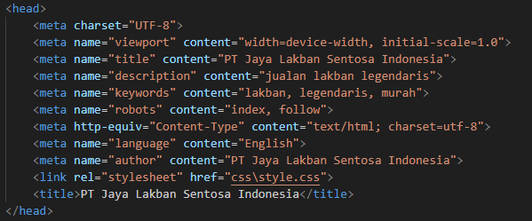
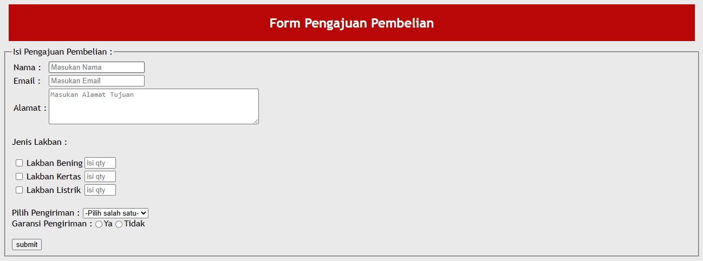
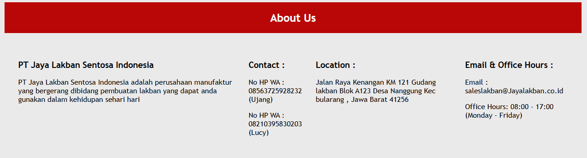

## Website PT Jaya Lakban Sentosa Indonesia

Readme ini bertujuan untuk memberi gambaran apa saja fungsi pada website ini, silahkan disimak 😊

### Meta Tag Website

Website ini menggunakan meta tag yang meliputi **title**, **description**, **keyword**, dan **author**

code yang digunakan seperti berikut:

meta tag tersebut digunakan untuk mempermudah proses ***SEO (Search Engine Optimization)*** untuk website ini.

### Header Website

Pada Bagian Header, terdapat beberapa fungsi diantaranya header dari nama Website, Image Logo perusahaan, serta Navigation bar.

pada bagian ini,code yang digunakan adalah menggunakan **h1**, **img** , dan **nav**.

Gambar yang digunakan berasal dari lokal storage untuk seluruh gambar yang ditampilkan pada website ini.

### Body Website

Pada bagian ini menunjukan isi dari point utama dari website, di dalam website ini menunjukan beberapa point utamanya yakni:

1. **Best Seller Product**

2. **Form Pengajuan Pembelian**

3. **Profile Perusahaan**

### Footer Website

Pada Bagian ini menunjukan dari footer website, biasanya disini berisi dari bentuk copyright website serta tombol menu untuk kembali ke atas **(home)** dari website ini

demikian readme dari website PT Jaya Lakban Sentosa Indonesia

                        **TERIMA KASIH**

